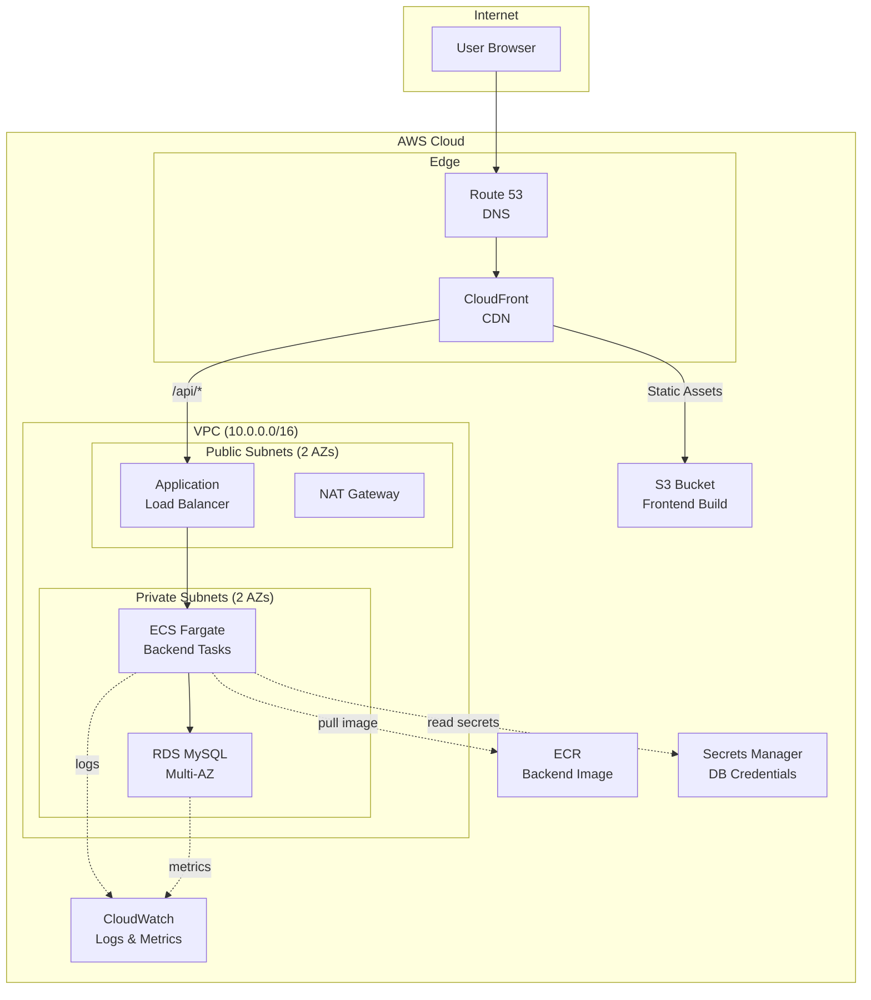
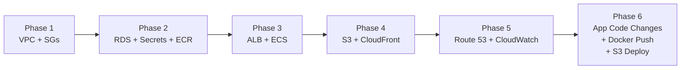

# Three-Tier AWS Deployment — Implementation Plan

## Architecture Overview

Deploy the school management app (React + Node.js + MySQL) to AWS using Terraform, replacing Docker Compose with a production-grade cloud architecture.



## Service-to-Tier Mapping

| Service | Tier | Role |
|---------|------|------|
| **Amazon S3** | Frontend | Hosts React production build as static files |
| **Amazon CloudFront** | Frontend | CDN + HTTPS termination + routes `/api/*` to ALB |
| **Amazon ECR** | Backend | Stores the backend Docker image |
| **Amazon ECS Fargate** | Backend | Runs backend containers serverlessly |
| **Application Load Balancer** | Backend | Load balances traffic to ECS tasks, health checks |
| **Amazon RDS** | Database | Managed MySQL replacing the Docker MySQL container |
| **AWS Secrets Manager** | Database | Stores DB credentials; ECS tasks read them at runtime |
| **Amazon VPC** | Network | Isolates tiers: public subnets for ALB, private for ECS + RDS |
| **Amazon Route 53** | DNS | Domain resolution → CloudFront distribution |
| **AWS CloudWatch** | Ops | Centralized logs from ECS tasks + RDS metrics/alarms |

---

## Terraform Module Structure

```
Three-Tier-Applications/
├── Docker-Compose-Projects/       # Existing app code (unchanged)
│   ├── frontend/
│   └── backend/
└── terraform/                     # NEW — all infra code
    ├── main.tf                    # Root module, calls child modules
    ├── variables.tf               # Root-level input variables
    ├── outputs.tf                 # Root-level outputs (URLs, endpoints)
    ├── providers.tf               # AWS provider + backend config
    ├── terraform.tfvars           # Variable values (gitignored)
    └── modules/
        ├── vpc/                   # VPC, subnets, NAT, IGW, route tables
        │   ├── main.tf
        │   ├── variables.tf
        │   └── outputs.tf
        ├── security_groups/       # SGs for ALB, ECS, RDS
        │   ├── main.tf
        │   ├── variables.tf
        │   └── outputs.tf
        ├── rds/                   # RDS MySQL instance + subnet group
        │   ├── main.tf
        │   ├── variables.tf
        │   └── outputs.tf
        ├── secrets_manager/       # DB credentials secret
        │   ├── main.tf
        │   ├── variables.tf
        │   └── outputs.tf
        ├── ecr/                   # ECR repository for backend image
        │   ├── main.tf
        │   ├── variables.tf
        │   └── outputs.tf
        ├── ecs/                   # ECS cluster, task def, service
        │   ├── main.tf
        │   ├── variables.tf
        │   └── outputs.tf
        ├── alb/                   # ALB, target group, listener
        │   ├── main.tf
        │   ├── variables.tf
        │   └── outputs.tf
        ├── s3_frontend/           # S3 bucket for React build
        │   ├── main.tf
        │   ├── variables.tf
        │   └── outputs.tf
        ├── cloudfront/            # CloudFront distribution
        │   ├── main.tf
        │   ├── variables.tf
        │   └── outputs.tf
        ├── route53/               # DNS records
        │   ├── main.tf
        │   ├── variables.tf
        │   └── outputs.tf
        └── cloudwatch/            # Log groups, alarms
            ├── main.tf
            ├── variables.tf
            └── outputs.tf
```

---

## Proposed Changes — Module by Module

### 1. VPC Module (`modules/vpc/`)

Creates the network foundation for all other services.

| Resource | Details |
|----------|---------|
| `aws_vpc` | CIDR `10.0.0.0/16`, DNS support enabled |
| `aws_subnet` (public × 2) | `10.0.1.0/24`, `10.0.2.0/24` — across 2 AZs |
| `aws_subnet` (private × 2) | `10.0.3.0/24`, `10.0.4.0/24` — across 2 AZs |
| `aws_internet_gateway` | Attached to VPC |
| `aws_nat_gateway` | In one public subnet (single NAT to save cost) |
| `aws_eip` | For NAT Gateway |
| `aws_route_table` × 2 | Public routes → IGW; Private routes → NAT |
| `aws_route_table_association` × 4 | Associate subnets to route tables |

**Outputs:** `vpc_id`, `public_subnet_ids`, `private_subnet_ids`

---

### 2. Security Groups Module (`modules/security_groups/`)

Three security groups with strict least-privilege rules:

| SG | Inbound | Outbound |
|----|---------|----------|
| **ALB SG** | `80/443` from `0.0.0.0/0` | Port `3000` to ECS SG |
| **ECS SG** | Port `3000` from ALB SG only | Port `3306` to RDS SG + `443` to `0.0.0.0/0` (ECR/Secrets) |
| **RDS SG** | Port `3306` from ECS SG only | None (deny all) |

**Outputs:** `alb_sg_id`, `ecs_sg_id`, `rds_sg_id`

---

### 3. Secrets Manager Module (`modules/secrets_manager/`)

| Resource | Details |
|----------|---------|
| `aws_secretsmanager_secret` | Named `three-tier/db-credentials` |
| `aws_secretsmanager_secret_version` | JSON: `{"username": "admin", "password": "<generated>", "host": "<rds_endpoint>", "database": "school"}` |

> [!IMPORTANT]
> The RDS endpoint is a dependency — this module takes it as input after RDS is created. We'll use `random_password` resource to generate the DB password and pass it to both RDS and Secrets Manager.

**Outputs:** `secret_arn`

---

### 4. RDS Module (`modules/rds/`)

| Resource | Details |
|----------|---------|
| `aws_db_subnet_group` | Private subnets |
| `aws_db_instance` | Engine: `mysql 8.0`, instance class: `db.t3.micro`, storage: 20GB, multi-AZ: `false` (cost), `skip_final_snapshot: true` (dev) |

Key settings:
- `db_name = "school"`
- `username` / `password` from `random_password`
- `vpc_security_group_ids = [rds_sg_id]`
- `publicly_accessible = false`

**Outputs:** `rds_endpoint`, `rds_port`

---

### 5. ECR Module (`modules/ecr/`)

| Resource | Details |
|----------|---------|
| `aws_ecr_repository` | Named `three-tier-backend` |
| `aws_ecr_lifecycle_policy` | Keep last 5 images (cleanup) |

**Outputs:** `repository_url`

> [!NOTE]
> After `terraform apply`, you'll push the backend Docker image to ECR manually:
> ```bash
> aws ecr get-login-password --region <region> | docker login --username AWS --password-stdin <account>.dkr.ecr.<region>.amazonaws.com
> docker build -t three-tier-backend ./Docker-Compose-Projects/backend/
> docker tag three-tier-backend:latest <ecr_repo_url>:latest
> docker push <ecr_repo_url>:latest
> ```

---

### 6. ALB Module (`modules/alb/`)

| Resource | Details |
|----------|---------|
| `aws_lb` | Application LB, internet-facing, public subnets |
| `aws_lb_target_group` | Target type: `ip` (Fargate), port `3000`, health check: `GET /` |
| `aws_lb_listener` | Port `80` → forward to target group |

**Outputs:** `alb_dns_name`, `alb_arn`, `target_group_arn`, `alb_hosted_zone_id`

---

### 7. ECS Module (`modules/ecs/`)

| Resource | Details |
|----------|---------|
| `aws_ecs_cluster` | Named `three-tier-cluster` |
| `aws_iam_role` (task execution) | Allows ECS to pull ECR images + read Secrets Manager + push CloudWatch logs |
| `aws_iam_role` (task role) | Attached to the container at runtime (for any AWS SDK calls) |
| `aws_ecs_task_definition` | Fargate, `256 CPU / 512 MiB`, container definition with secrets from Secrets Manager |
| `aws_ecs_service` | Desired count: `2`, ALB target group attachment, private subnets, assign public IP: `false` |

Container definition key points:
```json
{
  "name": "backend",
  "image": "<ecr_repo_url>:latest",
  "portMappings": [{ "containerPort": 3000 }],
  "secrets": [
    { "name": "host", "valueFrom": "<secret_arn>:host::" },
    { "name": "user", "valueFrom": "<secret_arn>:username::" },
    { "name": "password", "valueFrom": "<secret_arn>:password::" },
    { "name": "database", "valueFrom": "<secret_arn>:database::" }
  ],
  "logConfiguration": {
    "logDriver": "awslogs",
    "options": {
      "awslogs-group": "/ecs/three-tier-backend",
      "awslogs-region": "<region>",
      "awslogs-stream-prefix": "backend"
    }
  }
}
```

**Outputs:** `ecs_service_name`, `ecs_cluster_name`

---

### 8. S3 Frontend Module (`modules/s3_frontend/`)

| Resource | Details |
|----------|---------|
| `aws_s3_bucket` | Named `three-tier-frontend-<account_id>` |
| `aws_s3_bucket_public_access_block` | Block ALL public access (CloudFront uses OAC) |
| `aws_s3_bucket_policy` | Allow CloudFront OAC to `GetObject` |

> [!NOTE]
> After `terraform apply`, deploy the frontend:
> ```bash
> cd Docker-Compose-Projects/frontend
> REACT_APP_API_BASE_URL=https://<cloudfront_domain>/api npm run build
> aws s3 sync build/ s3://<bucket_name>/
> ```

**Outputs:** `bucket_id`, `bucket_regional_domain_name`, `bucket_arn`

---

### 9. CloudFront Module (`modules/cloudfront/`)

| Resource | Details |
|----------|---------|
| `aws_cloudfront_origin_access_control` | For S3 origin |
| `aws_cloudfront_distribution` | Two origins + cache behaviors: |

| Origin | Path Pattern | Behavior |
|--------|-------------|----------|
| **S3** (default) | `*` | Cached, redirect HTTP→HTTPS |
| **ALB** | `/api/*` | No cache, forward all headers/cookies, HTTPS only to origin |

Key settings:
- `default_root_object = "index.html"`
- Custom error response: `403 → /index.html` (SPA routing)
- `viewer_protocol_policy = "redirect-to-https"`

**Outputs:** `cloudfront_domain_name`, `cloudfront_distribution_id`, `cloudfront_hosted_zone_id`

---

### 10. Route 53 Module (`modules/route53/`)

| Resource | Details |
|----------|---------|
| `aws_route53_zone` | Data source (if zone exists) or new zone |
| `aws_route53_record` | A-record alias → CloudFront distribution |

> [!WARNING]
> Route 53 requires a registered domain. If you don't have a domain, you can skip this module and access the app directly via the CloudFront domain name (`d1234xxxxx.cloudfront.net`). The rest of the architecture works without it.

**Outputs:** `domain_name`

---

### 11. CloudWatch Module (`modules/cloudwatch/`)

| Resource | Details |
|----------|---------|
| `aws_cloudwatch_log_group` | `/ecs/three-tier-backend`, retention: 7 days |
| `aws_cloudwatch_metric_alarm` (ECS CPU) | Alarm if CPU > 80% for 5 min |
| `aws_cloudwatch_metric_alarm` (RDS CPU) | Alarm if CPU > 80% for 5 min |
| `aws_cloudwatch_metric_alarm` (RDS storage) | Alarm if free storage < 2GB |

**Outputs:** `log_group_name`, `log_group_arn`

---

## Required Application Code Changes

### Backend `server.js`

Minor changes needed for AWS compatibility:

1. **Remove hardcoded SSL** — RDS within a VPC doesn't require `ssl: { rejectUnauthorized: false }` (it's internal traffic)
2. **Add `/api` prefix** — CloudFront routes `/api/*` to ALB, so backend routes should be prefixed: `/api/student`, `/api/addstudent`, etc. Alternatively, use a CloudFront function to strip the prefix.
3. **Add health check endpoint** — ALB needs `GET /api/health` returning `200`

### Frontend

1. **Update API base URL** — `.env` should set `REACT_APP_API_BASE_URL` to the CloudFront domain with `/api` prefix (set at build time)
2. **No Dockerfile changes** — Frontend is built locally and uploaded to S3; Nginx is no longer needed

---

## Execution Order (Phased)

Dependencies dictate this order:



| Phase | Modules | Why |
|-------|---------|-----|
| 1 | VPC, Security Groups | Foundation — everything else lives here |
| 2 | RDS, Secrets Manager, ECR | Data tier + image registry (no upstream deps) |
| 3 | ALB, ECS | Backend compute — needs VPC, SGs, ECR, Secrets |
| 4 | S3, CloudFront | Frontend hosting — needs ALB DNS for origin config |
| 5 | Route 53, CloudWatch | DNS + monitoring — needs CloudFront + ECS/RDS |
| 6 | Deploy | Push Docker image to ECR, build & sync frontend to S3 |

> [!NOTE]
> Terraform handles dependency ordering automatically via resource references. The phases above are logical groupings — a single `terraform apply` will create everything in the correct order.

---

## User Review Required

> [!IMPORTANT]
> **Domain name**: Do you have a Route 53 hosted zone / registered domain? If not, I'll make Route 53 optional and you'll access the app via CloudFront's auto-generated URL.

> [!IMPORTANT]
> **API routing strategy**: Two options for routing `/api/*` to the backend:
> 1. **Prefix backend routes** with `/api` (e.g., `/api/student`) — requires small `server.js` changes
> 2. **CloudFront Function** to strip `/api` prefix before forwarding to ALB — no backend changes needed
>
> Which do you prefer?

> [!IMPORTANT]
> **RDS sizing**: Plan uses `db.t3.micro` (free-tier eligible). Want a larger instance?

> [!IMPORTANT]
> **ECS sizing**: Plan uses `256 CPU / 512 MiB` with 2 tasks. Adjust?

## Verification Plan

### Automated Tests
- `terraform validate` — syntax/config checks
- `terraform plan` — dry-run to review all resources before apply
- `curl <cloudfront_url>` — verify frontend loads
- `curl <cloudfront_url>/api/student` — verify backend API via CloudFront → ALB → ECS → RDS pipeline
- `aws ecs describe-services` — verify tasks are RUNNING
- `aws cloudwatch describe-alarms` — verify alarms are configured

### Manual Verification
- Open CloudFront URL in browser, test CRUD operations (add/delete students and teachers)
- Check CloudWatch log group for backend container logs
- Verify RDS connectivity from ECS tasks via logs
